# CubeMind

Python orchestration layer for a polyglot neuro-symbolic cognitive architecture —
VSA block-codes, spiking neural networks, continuous-learning memory, and a
45-opcode vector-symbolic VM.

CubeMind achieves **90.3% zero-shot accuracy on I-RAVEN** using deterministic
integer-domain rule detectors — no gradient training for the core reasoning
pipeline.

## License

BSL-1.1 — open source for non-commercial use. See `LICENSE` for details.

---

## Ecosystem

CubeMind is the Python integration layer for five interoperating repos:

| Repo | Language | Role |
|---|---|---|
| **cubemind** (this repo) | Python 3.12 | Orchestration, VSA-VM, training, API |
| [grilly](../grilly) | C++/Vulkan + Python | GPU framework, 230+ GLSL shaders, pybind11 |
| [opcode-vsa-rs](../opcode-vsa-rs) | Rust | VSA algebra, ANN, SIMD hot paths |
| [cubelang](../cubelang) | Rust | `.cube` → VM bytecode compiler |
| [optimum-grilly](../optimum-grilly) | Python | HuggingFace Optimum backend for Grilly |

See `CLAUDE.md` for full cross-repo rules and opcode-sync requirements.

---

## Processing Pipeline



```
Input
  → Perception         (text / vision / audio → VSA block-codes)
  → SNN                (GIFNeuron + STDP → temporal spike pattern)
  → Neurochemistry     (5-hormone ODE → routing signal)
  → HippocampalFormation (place + time + grid → episodic memory)
  → VSA-LM             (embed → [VSALayer × N] → logits + MindForge LoRA)
  → MoQE               (2/4/6/8-bit quantized MoE)
  → Output / API
```

All 45 VSA-VM opcodes and safety guards (SDLS duality gate, `max_instructions`
cap, DIV-by-zero → 0, unknown-target no-ops) are documented in
`cubemind/reasoning/vm.md`.

---

## Package Layout

```
cubemind/
    core/          Registry, base protocols, typed constants (K=80, L=128, D=10240)
    model.py       Orchestrator — DI-injected, _safe_call fault isolation
    container.py   dependency-injector DI container
    __main__.py    Click CLI

    ops/           VSA block-code algebra — 3-level fallback (grilly C++ → Python GPU → numpy)
    perception/    Encoders: text, bio-vision, Harrier, SNN, audio, grilly densenet/resnet
    brain/         SNN + neurological — GIFNeuron, Synapsis, Neurochemistry, Neurogenesis, AdditionLinear
    memory/        HippocampalFormation, VSACache, legacy HippocampalMemory
    reasoning/     VSA-VM (45 opcodes), HMM rule detector, HD-GoT (DEBATE), vs_graph, Sinkhorn
    execution/     MindForge, MoQE, HYLA, CVL, Decoder, WorldEncoder, WorldManager
    routing/       Prototype router, DSelect-k MoE gate
    training/      VSA-LM trainer, MoQE distillation
    functional/    math helpers (softmax, sigmoid, gelu)
    cloud/         FastAPI — rewire scheduled for Phase 3.3
    experimental/  bandits (EXPLORE/REWARD opcodes) — everything else archived
```

See `.claude/plan/architecture-map.md` for the living status map and
`TASKS.md` for the phased roadmap.

---

## Module Registry — 27 modules / 11 roles

All pipeline modules are declared via `@register("role", "name")` in
`core/registry.py`:

| Role | Names |
|---|---|
| ops | `block_codes`, `hdc`, `vsa_bridge` |
| encoder | `bio_vision`, `harrier`, `text`, `world` |
| executor | `decoder`, `hyla`, `mindforge`, `moqe`, `world_manager` |
| memory | `hippocampal`, `hippocampal_legacy`, `vsa_cache` |
| processor | `addition_linear`, `gif_neuron`, `hybrid_ffn`, `synapsis` |
| modulator | `neurochemistry`, `neurogenesis` |
| detector | `hmm_rule` |
| estimator | `cvl` |
| bridge | `spike_vsa` |
| router | `dselect_k`, `prototype` |
| runtime | `vsa_vm` |

Resolve at runtime:

```python
from cubemind.core.registry import registry
encoder = registry.create("encoder", "bio_vision", k=80, l=128)
```

---

## Install

Requires Python 3.12, [uv](https://github.com/astral-sh/uv), and a Vulkan 1.3
GPU (development target: AMD RX 6750 XT, RDNA2, gfx1031).

```bash
uv venv
uv pip install -e ".[dev]"
uv pip install grilly   # or set [tool.uv.sources] grilly = { path = "../grilly", editable = true }
```

`onnx` is permanently excluded (CVE-2026-28500). Do not re-add.

---

## CLI

```bash
python -m cubemind version
python -m cubemind demo --k 8 --l 64
python -m cubemind forward "hello world"
python -m cubemind train vsa-lm
python -m cubemind api --port 8000      # pending Phase 3.3 rewire
```

Webapp (scaffolded, no features yet):

```bash
cd webapp && npm run dev
```

---

## Tests

```bash
uv run ruff check cubemind/ tests/ benchmarks/

# Quick suite — excludes slow sinkhorn + embargoed RAVEN
uv run pytest tests/ -v -q \
    --ignore=tests/test_sinkhorn.py \
    --ignore=tests/test_raven_world_manager.py \
    -x --tb=short

# Full suite
uv run pytest tests/ -v --tb=short --timeout=60
```

**Current status:** 813 tests passing; 2 pre-existing mindforge numerical-drift
failures deselected; I-RAVEN tests under NeurIPS 2026 embargo.

---

## VSA-VM Opcodes (45)

Canonical source lives in three files that must stay in sync:

| File | Role |
|---|---|
| `cubemind/reasoning/vm.py` | Python VM (source of truth) |
| `opcode-vsa-rs/src/ir.rs` | Rust execution engine |
| `cubelang/src/vm.rs` | CubeLang compiler |

Adding an opcode requires a coordinated PR across all three. Hash-to-bipolar
(BLAKE3) must match between `grilly/utils/stable_hash.py` and
`opcode-vsa-rs/src/vsa_hash.rs`.

---

## Roadmap

Phased delivery is tracked in `TASKS.md`:

| Phase | Status |
|---|---|
| 0 — Repo cleanup | ✅ Done (2026-04-15) |
| 1 — CubeMind-213M MinGRU sandbox baseline (val PPL ≤ 6 on news prose) | ✅ Done (2026-04-20, val PPL 5.17 at step 8,000 / 589M tok on H200 SXM) |
| 1.5 — Temporal / identity fine-tune on stage-1 checkpoint | Pending |
| 2 — VSALMModel wiring | Pending |
| 3 — Training loop + sleep cycle + api rewire | Pending |
| 4 — CubeMind extension ablations (snn, forge, mem) | Pending |
| 5 — Continuous learning wired in (EWC, STDP, replay) | Pending |
| 6 — MoWM grid-world evaluation | Pending |
| 7 — Cross-repo consistency (optimum-grilly, opcodes) | Pending |
| 8 — Paper finalization (MoWM + VSA-LM ablation) | Pending |

---

## Embargo Notice

- **I-RAVEN + `reasoning/rule_detectors.py`** — under NeurIPS 2026 embargo.
  Do not commit, publish, or discuss outside the repo.
- **`docs/project_knowledge/`** — `.donotpush`; never commit.
- **`_archive/`, `data/external_llms/`** — gitignored; never commit from.
